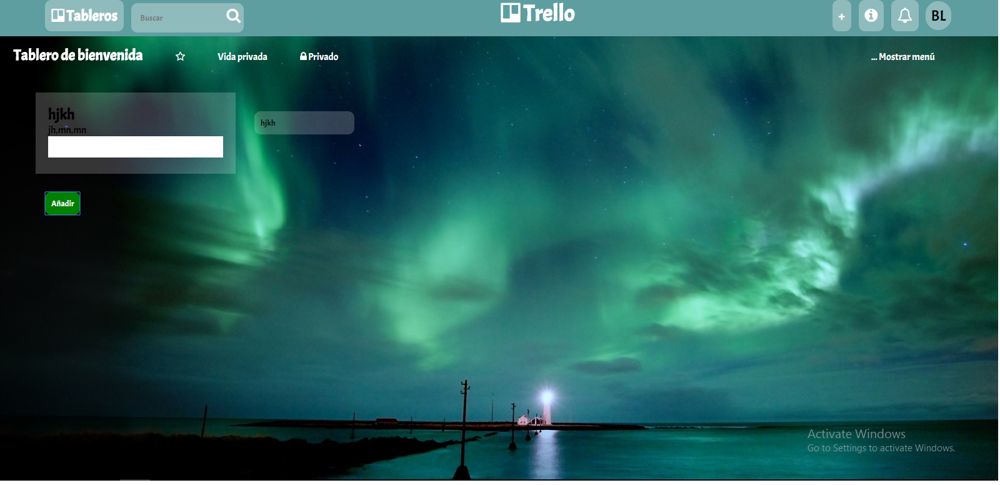

## Trello

Realización del ejercicio práctico Trello.

* vista del archivo original

### ELementos utilizdos:
 
#### Css
 
 * Estilo para la pag. html

#### Assets

 * Recursos para la pag. html

#### Js

 * Lenguaje para dar interaccion y crear un pag.dinámica para el usuario

#### Index.html

 * Archivo para realizar la estructura de la pag. web